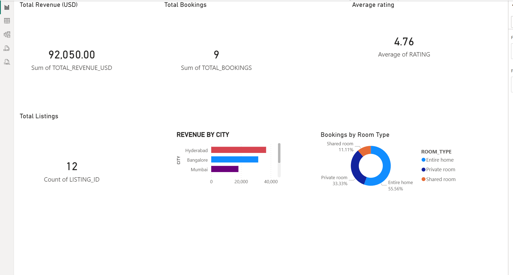
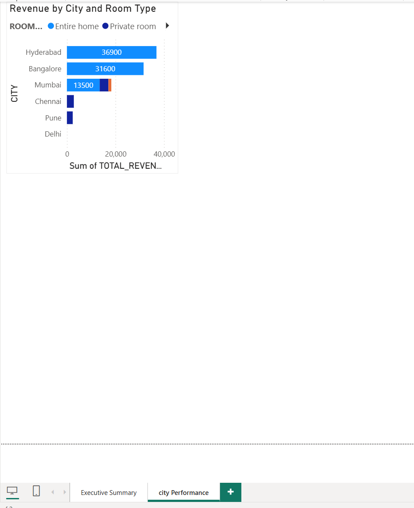

# Airbnb ELT Pipeline

A production-grade ELT pipeline built on AWS, Snowflake, DBT, and Apache Airflow. Ingests raw Airbnb-style transaction data from S3, auto-loads via Snowpipe, transforms through a Medallion architecture (Bronze → Silver → Gold), and orchestrates daily runs with Airflow — all protected by a GitHub Actions CI/CD quality gate.

---

## Architecture

```
S3 (raw CSVs)
    ↓ S3 event notification
SQS Queue
    ↓ AUTO_INGEST
Snowpipe → Bronze (raw layer)
    ↓ dbt run
Silver (cleaned + typed)
    ↓ dbt run
Gold (analytics-ready marts)
    ↓ dbt test
58 automated quality tests
    ↓ Airflow DAG
Orchestrated daily pipeline
    ↓ GitHub Actions
CI/CD quality gate on every PR
```

---

## Tech Stack

| Layer | Technology |
|---|---|
| Cloud storage | AWS S3 |
| Schema catalog | AWS Glue + Data Catalog |
| Access control | AWS IAM |
| Event streaming | AWS SQS |
| Auto-ingestion | Snowflake Snowpipe |
| Data warehouse | Snowflake |
| Transformation | DBT (dbt-snowflake 1.7) |
| Orchestration | Apache Airflow 2.8 (Astro CLI) |
| CI/CD | GitHub Actions |
| Containerization | Docker |

---

## Project Structure

```
airbnb-elt-pipeline/
├── models/
│   ├── staging/
│   │   ├── sources.yml              # Source definitions + tests
│   │   ├── schema.yml               # Column-level tests
│   │   ├── stg_listings.sql
│   │   ├── stg_bookings.sql
│   │   ├── stg_reviews.sql
│   │   └── stg_hosts.sql
│   ├── intermediate/
│   │   ├── int_bookings_enriched.sql    # Incremental merge
│   │   └── int_listings_with_metrics.sql # Incremental merge
│   └── marts/
│       ├── mart_listings.sql            # Gold — listing performance
│       ├── mart_revenue.sql             # Gold — revenue by city + month
│       └── mart_host_performance.sql    # Gold — host metrics + tier
├── snapshots/
│   ├── snap_listings.sql            # SCD Type 2 — price + availability
│   └── snap_hosts.sql               # SCD Type 2 — superhost status
├── tests/
│   ├── assert_positive_revenue.sql
│   ├── assert_checkout_after_checkin.sql
│   ├── assert_valid_rating_range.sql
│   └── assert_no_orphan_bookings.sql
├── airflow/
│   ├── dags/
│   │   ├── airbnb_elt_pipeline.py   # Main DAG
│   │   └── airbnb_dbt/              # DBT project copy for Docker
│   ├── Dockerfile
│   └── requirements.txt
├── .github/
│   └── workflows/
│       └── dbt_ci.yml               # CI/CD workflow
├── dbt_project.yml
├── packages.yml
└── README.md
```

---

## Data Model

### Source entities (Bronze layer)

| Table | Rows | Description |
|---|---|---|
| `RAW_LISTINGS` | ~10 | Property listings across Indian cities |
| `RAW_BOOKINGS` | ~10 | Guest booking transactions |
| `RAW_REVIEWS` | ~7 | Guest reviews with sub-ratings |
| `RAW_HOSTS` | ~9 | Host profiles and metrics |

### Medallion layers

**Bronze** — raw, immutable, append-only. Loaded by Snowpipe directly from S3. No transformations.

**Silver** — cleaned and typed. String → proper types (`DATE`, `NUMBER`, `BOOLEAN`). Nulls filtered. Derived columns computed (`avg_sub_rating`). Normalized casing.

**Gold** — analytics-ready. Business metrics computed. Joined across entities. Aggregated for BI consumption.

### Gold mart tables

| Table | Description | Key metrics |
|---|---|---|
| `MART_LISTINGS` | Listing performance | occupancy_rate, total_revenue_usd, avg_rating |
| `MART_REVENUE` | Revenue by city + month | total_revenue_usd, cancellation_rate_pct |
| `MART_HOST_PERFORMANCE` | Host metrics | performance_tier, avg_rating, total_bookings |

---

## DBT Models

### Model types

| Type | Count | Strategy |
|---|---|---|
| Staging views | 4 | Materialized as VIEW — lightweight |
| Incremental tables | 2 | Merge on unique_key — only new rows processed |
| Mart tables | 3 | Full table rebuild — aggregations always current |
| Snapshots | 2 | SCD Type 2 — full history preserved |

### Incremental strategy

```sql
{{
    config(
        materialized         = 'incremental',
        unique_key           = 'booking_id',
        incremental_strategy = 'merge'
    )
}}


    WHERE ingestion_date > (
        SELECT MAX(ingestion_date) FROM {{ this }}
    )

```

First run processes all rows. Subsequent runs process only new rows — makes daily runs fast regardless of table size.

### SCD Type 2 snapshots

Tracks historical changes to listings (price, availability) and hosts (superhost status, response rate). Every change creates a new versioned row with `dbt_valid_from`, `dbt_valid_to`, and `dbt_is_current` columns.

### Automated tests — 58 total

| Test type | Count | Examples |
|---|---|---|
| `not_null` | 20+ | `booking_id`, `listing_id`, `host_id` |
| `unique` | 8 | Primary keys on all staging models |
| `accepted_values` | 10+ | `booking_status`, `room_type`, `rating` |
| `relationships` | 4 | Bookings → Listings, Reviews → Listings |
| Custom SQL | 4 | Positive revenue, valid dates, rating range, no orphans |

---

## Snowpipe Auto-Ingestion

Files land in S3 → S3 sends event to SQS → Snowpipe reads SQS → rows loaded into Bronze within 60 seconds. Zero manual intervention.

```
S3 upload
    ↓ s3:ObjectCreated:* event
SQS queue (airbnb-snowpipe-sqs)
    ↓ AUTO_INGEST polling
pipe_raw_listings  →  BRONZE.AIRBNB.RAW_LISTINGS
pipe_raw_bookings  →  BRONZE.AIRBNB.RAW_BOOKINGS
pipe_raw_reviews   →  BRONZE.AIRBNB.RAW_REVIEWS
pipe_raw_hosts     →  BRONZE.AIRBNB.RAW_HOSTS
```

S3 folder structure follows Hive-style partitioning:
```
s3://airbnb-elt-raw/
├── listings/ingestion_date=2024-01-01/listings.csv
├── bookings/ingestion_date=2024-01-01/bookings.csv
├── reviews/ingestion_date=2024-01-01/reviews.csv
└── hosts/ingestion_date=2024-01-01/hosts.csv
```

---

## Airflow DAG

On-demand pipeline with 10 tasks:

```
start_pipeline
    → refresh_snowpipes
    → wait_for_snowpipe (60s buffer)
    → dbt_deps
    → dbt_snapshot
    → dbt_run_staging
    → dbt_run_intermediate
    → dbt_run_marts
    → dbt_test
    → end_pipeline
```

Configured with `schedule=None` — trigger manually via Airflow UI or programmatically via API. Retry logic: 1 retry with 5-minute delay on failure.

---

## CI/CD — GitHub Actions

Two jobs in `.github/workflows/dbt_ci.yml`:

**PR job** — triggered on every pull request to `main`:
- Installs DBT
- Runs `dbt compile` — validates SQL syntax
- Runs `dbt run --select state:modified+` — only changed models
- Runs `dbt test --select state:modified+` — tests on changed models
- Blocks merge if any test fails

**Deploy job** — triggered on every push to `main`:
- Full `dbt snapshot` → `dbt run` → `dbt test` on production
- Uploads `manifest.json` and `run_results.json` as artifacts

Snowflake credentials stored as GitHub encrypted secrets — never in code.

---

## Setup

### Prerequisites

- AWS account with S3, Glue, IAM, SQS access
- Snowflake account (free trial at snowflake.com)
- Python 3.11+
- Docker Desktop
- Astro CLI (`winget install -e --id Astronomer.Astro`)

### 1. AWS setup

```bash
# Create S3 bucket
aws s3api create-bucket \
  --bucket airbnb-elt-raw \
  --region ap-south-1

# Upload sample data
aws s3 cp listings.csv \
  s3://airbnb-elt-raw/listings/ingestion_date=2024-01-01/listings.csv
```

Create IAM roles:
- `airbnb-elt-glue-role` — for Glue crawler (S3 read + Glue catalog write)
- `airbnb-elt-snowflake-role` — for Snowflake S3 access (S3 read)

### 2. Snowflake setup

```sql
USE ROLE ACCOUNTADMIN;

CREATE WAREHOUSE AIRBNB_WH WAREHOUSE_SIZE='X-SMALL' AUTO_SUSPEND=60 AUTO_RESUME=TRUE;
CREATE DATABASE BRONZE;
CREATE DATABASE SILVER;
CREATE DATABASE GOLD;
CREATE SCHEMA BRONZE.AIRBNB;
CREATE SCHEMA SILVER.AIRBNB;
CREATE SCHEMA GOLD.AIRBNB;

CREATE STORAGE INTEGRATION airbnb_s3_integration
  TYPE = EXTERNAL_STAGE
  STORAGE_PROVIDER = 'S3'
  ENABLED = TRUE
  STORAGE_AWS_ROLE_ARN = 'arn:aws:iam::YOUR_ACCOUNT:role/airbnb-elt-snowflake-role'
  STORAGE_ALLOWED_LOCATIONS = ('s3://airbnb-elt-raw/');
```

### 3. DBT setup

```bash
pip install dbt-snowflake==1.7.0
cd airbnb_dbt
dbt deps
dbt debug       # verify connection
dbt build       # run all models + tests
```

### 4. Airflow setup

```bash
cd airflow
astro dev start
```

Open `http://localhost:8080` → trigger `airbnb_elt_pipeline` DAG.

### 5. GitHub Actions setup

Add these secrets to your repo (**Settings → Secrets → Actions**):

```
SNOWFLAKE_ACCOUNT   →  your_account_id.ap-south-1
SNOWFLAKE_USER      →  your_username
SNOWFLAKE_PASSWORD  →  your_password
SNOWFLAKE_ROLE      →  AIRBNB_ELT_ROLE
```

---

## Running the pipeline

### Trigger via Airflow UI

```
http://localhost:8080
→ airbnb_elt_pipeline
→ ▶ Trigger DAG
```

### Trigger via DBT directly

```bash
dbt snapshot --target prod
dbt run --target prod
dbt test --target prod
```

### Add new data

```bash
aws s3 cp - s3://airbnb-elt-raw/listings/ingestion_date=2024-01-04/listings.csv <<'EOF'
listing_id,host_id,neighbourhood,...
LST-015,HST-112,...
EOF
```

Snowpipe auto-ingests within 60 seconds. Next Airflow run picks it up automatically.

---

## Sample queries

```sql
-- Top cities by revenue
SELECT city, room_type, total_revenue_usd, occupancy_rate
FROM GOLD.AIRBNB.MART_LISTINGS
ORDER BY total_revenue_usd DESC NULLS LAST;

-- Monthly revenue trend
SELECT booking_month, city, total_revenue_usd, cancellation_rate_pct
FROM GOLD.AIRBNB.MART_REVENUE
ORDER BY booking_month, total_revenue_usd DESC;

-- Superhost performance comparison
SELECT is_superhost, AVG(avg_rating), AVG(total_revenue_usd), COUNT(*)
FROM GOLD.AIRBNB.MART_HOST_PERFORMANCE
GROUP BY is_superhost;

-- Listing price history (SCD Type 2)
SELECT listing_id, price_usd, dbt_valid_from, dbt_valid_to, dbt_is_current
FROM SILVER.AIRBNB.SNAP_LISTINGS
WHERE listing_id = 'LST-001'
ORDER BY dbt_valid_from;
```

---

## Key concepts demonstrated

- **Snowpipe** — event-driven auto-ingestion via S3 → SQS → Snowflake
- **Medallion architecture** — Bronze/Silver/Gold layered data platform
- **Incremental models** — merge strategy processes only new/changed rows
- **SCD Type 2** — full historical tracking via DBT snapshots
- **Automated testing** — 58 tests run on every pipeline execution
- **Slim CI** — `state:modified+` runs tests only on changed models
- **Least-privilege IAM** — separate roles for Glue and Snowflake with minimal permissions
- **Storage integration** — secure S3 access without hardcoded credentials

---

## PowerBI Dashbaords


<br><br><br><br>


